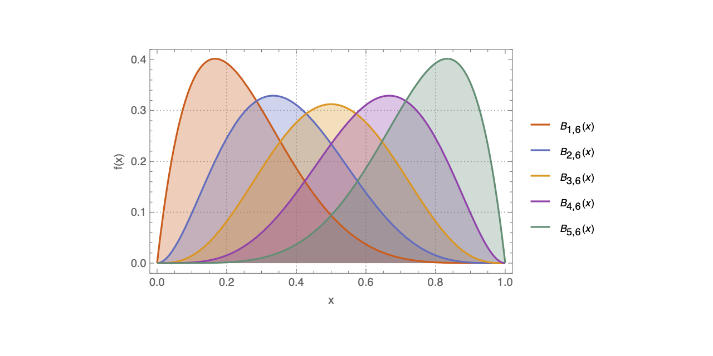

Amber provides code to evaluate multivariate Bernstein polynomials for multivariate polynomial
regression using de Casteljau's algorithm.

# Getting started 
 
Building this software requires [CMake](https://cmake.org) and a compiler that implements
the Fortran 2008 standard. To build the code and run the tests `cd` into the project root
directory and type:

    mkdir cmake-build
    cd cmake-build
    cmake -DCMAKE_BUILD_TYPE=(Release|Debug) ..
    make all test

To use a specific Fortran compiler set the `FC` and `CC` environment variables, like

    export FC=gfortran
    export CC=gcc

*before* you execute the `cmake ...` command.

# Further reading

Esmeralda Mainar, J.M. Pena (2006). "Evaluation algorithms for multivariate polynomials in Bernstein–Bezier form."
Journal of Approximation Theory 143, 44–61. <https://doi.org/10.1016/j.jat.2006.05.007>.

