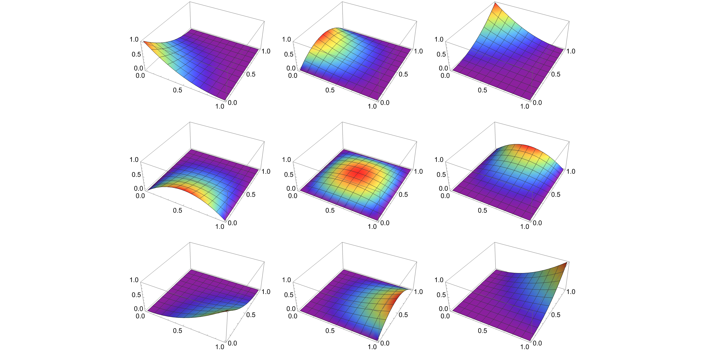

Amber provides code to evaluate multivariate Bernstein polynomials in
[TensorFlow](https://www.tensorflow.org) using
[De Casteljau's algorithm](https://en.wikipedia.org/wiki/De_Casteljau%27s_algorithm).
Multivariate Bernstein basis polynomials are particularly useful for linear multivariate
regression with linear inequality constraints.

# Getting started

Amber requires [miniconda](https://docs.conda.io/en/latest/miniconda.html). To test the Amber software `cd` into the project root directory and type:

    conda env create --file=./environment.yml
    conda activate tf2
    pytest --disable-warnings

# Further reading

Mama Foupouagnigni, Merlin Mouafo Wouodjié (2020). "On Multivariate Bernstein Polynomials" 
Mathematics 8, 1397. <https://doi.org/10.3390/math8091397>

Esmeralda Mainar, J.M. Pena (2006). "Evaluation algorithms for multivariate polynomials in Bernstein-Bezier form."
Journal of Approximation Theory 143, 44-61. <https://doi.org/10.1016/j.jat.2006.05.007>.
